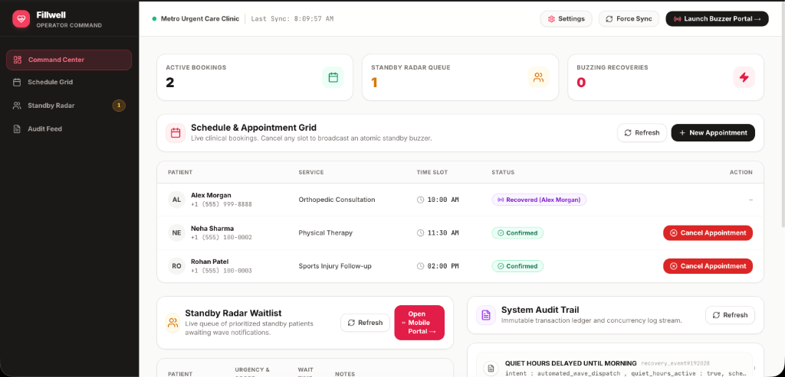
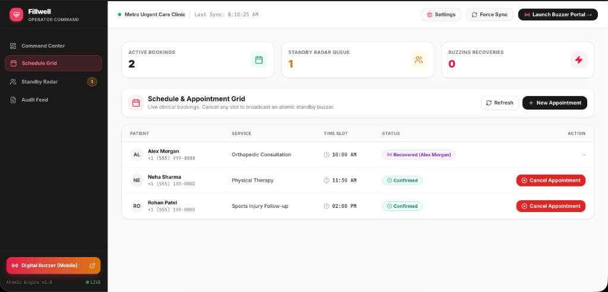
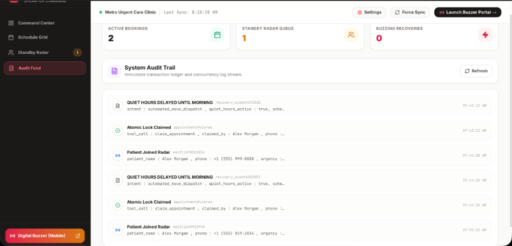
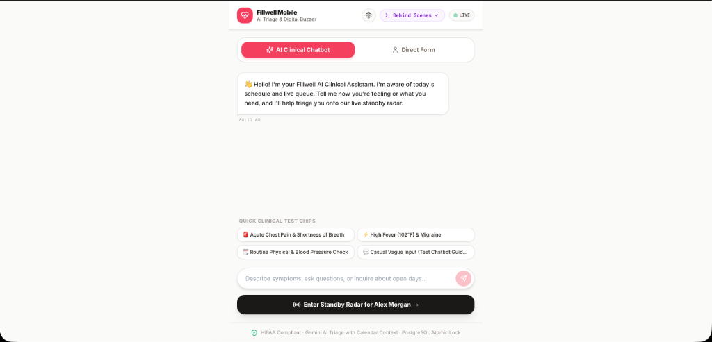
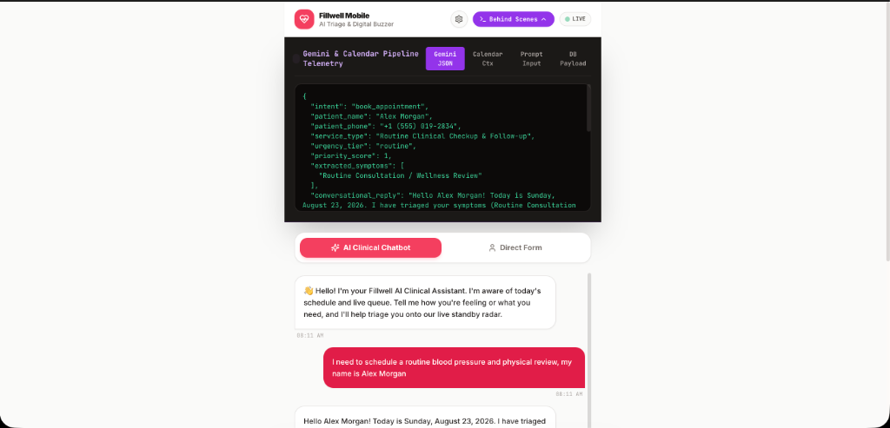

# ⚡ Fillwell — Autonomous Clinical Slot Recovery & Dual-View Platform

Fillwell is an enterprise-grade autonomous clinical scheduling and slot-recovery platform. When booked patient appointments are cancelled, Fillwell instantly broadcasts recovery waves to standby patients, allowing them to compete in an urgent digital buzzer race backed by sub-millisecond **PostgreSQL Pessimistic Row Locking (`FOR UPDATE`)** to guarantee zero double-bookings.

The system features a **Dual-View Architecture** (Operator Dashboard + Mobile Digital Buzzer Portal) powered by **Google Gemini 1.5 Clinical AI** with real-time calendar context and progressive conversational chatbot guidance.

---

## 📸 System Architecture & Dual-View Flow

```
+───────────────────────────────────────────────────────────────────────────────────────────────────+
|                                    VIEW 1: OPERATOR COMMAND CENTER                                 |
|                                         (Desktop: /dashboard)                                     |
|                                                                                                   |
|  [ Schedule Grid Panel ] ──► Click "Cancel Appointment" (Dr. Sarah Lin - 2:00 PM)                 |
|                                     │                                                             |
|                                     ▼ (PATCH /api/appointments/:id)                               |
|                     Update DB Status to "recovering" & Dispatch Wave                              |
+───────────────────────────────────────────────────────────────────────────────────────────────────+
                                      │
                                      ▼ (Supabase Realtime Broadcast & 1.5s Polling)
+───────────────────────────────────────────────────────────────────────────────────────────────────+
|                                  VIEW 2: MOBILE DIGITAL BUZZER PORTAL                             |
|                                          (Mobile: /portal)                                        |
|                                                                                                   |
|  [State A: Onboarding]   ──► Gemini AI Chatbot Triage (Aware of Date, Time & Acuity)              |
|                                     │ (User enters waitlist)                                      |
|  [State B: The Radar]    ──► Minimalist Pulsing Waiting Screen: "Waiting for an opening..."       |
|                                     │ (Instant Realtime Cancellation Trigger)                     |
|  [State C: The Race]     ──► Bright Red Emergency Screen with massive "CLAIM SLOT NOW" button     |
|                                     │                                                             |
|                                     ▼ (POST /api/claim-slot)                                      |
|                     PostgreSQL Atomic Lock: SELECT ... FOR UPDATE                                 |
|                                     │                                                             |
|          ┌──────────────────────────┴──────────────────────────┐                                  |
|          ▼ (Winner - HTTP 200)                                 ▼ (Contention - HTTP 409)          |
|  [State D: Slot Secured! 🎉]                         [State D: Slot Taken by Another Patient]     |
+───────────────────────────────────────────────────────────────────────────────────────────────────+
```

---

## 🖼️ Application Screenshots & Live Interface

### 1. View 1: Operator Command Center (`/dashboard`)
*Unified desktop control center with real-time active bookings counter, priority standby waitlist, schedule management, and instant 1-click slot cancellation.*



---

### 2. Schedule Grid & 1-Click Slot Cancellation
*Interactive appointment grid displaying patient bookings with live status badges (`Confirmed`, `Recovered`, `Recovering`) and red cancellation triggers with loading states.*



---

### 3. Immutable System Audit Feed & Real-Time Ledger
*Real-time streaming ledger permanently recording all cancellations, quiet hours delays, wave broadcasts, and atomic lock claims with exact millisecond timestamps.*



---

### 4. View 2: Mobile Digital Buzzer & AI Clinical Chatbot (`/portal`)
*Mobile-first patient portal with Gemini 1.5 conversational clinical triage, live calendar awareness, acuity evaluation, and quick-test clinical chips.*



---

### 5. Behind-the-Scenes Pipeline & Gemini JSON Telemetry
*Collapsible developer telemetry drawer rendering real-time structured Gemini JSON outputs, live calendar context, prompt payloads, and target PostgreSQL mutations.*



---

## 🌟 Core Features

### 1. View 1: Operator Command Center (`/dashboard`)
- **Schedule Grid Panel**: Real-time table displaying today's appointments. Each booked slot features a functional red **"Cancel Appointment"** button with automatic loading spinners (`<Loader2 />`), immediate status updates to `recovering`, and instant recovery wave triggers.
- **Standby Radar Waitlist**: Real-time table of standby patients sorted by urgency acuity and priority score, with 1-click priority score bumping and removal.
- **System Audit Feed**: Live streaming ledger logging cancellations, wave triggers, and atomic claim locks with timestamps and payloads.
- **`+ New Appointment` Dialog**: Fast modal to schedule new patient slots for live testing.
- **`⚙️ Settings & System Controls`**: Configures simulated date/time, wave batch size, quiet hours, and test data seeding.

### 2. View 2: Mobile Digital Buzzer Portal (`/portal`)
- **Strictly Mobile-Optimized 4-State State Machine**:
  - **State A (Onboarding & Gemini AI Chat)**: Conversational clinical triage powered by Gemini AI with live calendar awareness. If user input is vague, the AI asks guiding questions to reach a complete JSON intake. Also includes a direct form mode.
  - **State B (The Radar)**: Minimalist waiting radar screen (*"Waiting for an opening..."*) listening in real time.
  - **State C (The Race)**: Immediate full-screen red emergency mode when an operator cancels a slot, displaying a massive full-width **"CLAIM SLOT NOW"** button.
  - **State D (Resolution)**:
    - **Winner (HTTP 200)**: Green confirmation screen (*"Slot Secured!"*) confirming the atomic lock.
    - **Contention / Loser (HTTP 409)**: Gray screen (*"Slot taken by another patient. Still waiting..."*) with a 1-click button to resume the radar.
- **`[⚡ Behind Scenes]` Telemetry Inspector**: Interactive developer drawer displaying:
  - **Gemini JSON**: Real-time structured JSON extraction (`intent`, `urgency_tier`, `priority_score`, `extracted_symptoms`).
  - **Calendar Context**: Live calendar telemetry (`current_date`, `current_time`, `is_clinic_open_now`, `operating_hours`).
  - **Prompt Input**: Raw prompt and conversation history dispatched to `/api/gemini/triage`.
  - **DB Payload**: Target database mutation payload for `waitlist_entries`.

### 3. Concurrency & Pessimistic Row-Locking Engine
- Atomic database RPCs (`claim_appointment` and `execute_production_claim`) using PostgreSQL `SELECT ... FOR UPDATE` row locks.
- Returns **HTTP 409 Conflict** on simultaneous claim contention to completely prevent double-booking.
- Automatically culls matching waitlist entries upon successful slot claim.

---

## 📁 Repository Structure

```
ikigai_schlop_final.build/
├── fillwell/                           # Primary Next.js 14 Web Application
│   ├── src/
│   │   ├── app/
│   │   │   ├── (admin)/
│   │   │   │   └── dashboard/
│   │   │   │       └── page.tsx        # View 1: Operator Command Center
│   │   │   ├── (patient)/
│   │   │   │   ├── login/
│   │   │   │   │   └── page.tsx        # Authentication & Demo Login
│   │   │   │   └── portal/
│   │   │   │       └── page.tsx        # View 2: Mobile Digital Buzzer Portal
│   │   │   ├── api/
│   │   │   │   ├── appointments/       # GET/POST appointments, PATCH /:id (cancellations)
│   │   │   │   ├── claim-slot/         # POST atomic lock claim with 409 contention detection
│   │   │   │   ├── gemini/triage/      # POST Gemini AI clinical triage with calendar context
│   │   │   │   ├── waitlist/           # GET/POST standby radar entries & priority bumping
│   │   │   │   ├── settings/           # GET/PATCH clinic configuration & date simulation
│   │   │   │   ├── sandbox/            # POST seed demo schedule & purge database
│   │   │   │   └── audit/              # GET immutable audit logs
│   │   │   ├── layout.tsx              # Root HTML & Sonner toast provider
│   │   │   ├── page.tsx                # Dual-View launchpad switcher & QR code sharing
│   │   │   └── globals.css             # Tailwind CSS tokens & glassmorphism utilities
│   │   ├── components/
│   │   │   ├── dashboard/
│   │   │   │   ├── SchedulePanel.tsx   # Live appointments table & cancel actions
│   │   │   │   ├── WaitlistPanel.tsx   # Priority standby radar queue
│   │   │   │   ├── AuditFeed.tsx       # Real-time transaction audit ledger
│   │   │   │   ├── CreateAppointmentDialog.tsx # New slot booking modal
│   │   │   │   └── SettingsModal.tsx   # Calendar override & capacity configuration modal
│   │   │   └── ui/
│   │   │       └── EmptyState.tsx      # Clean empty state components
│   │   └── lib/
│   │       ├── services/
│   │       │   ├── gemini.ts           # Gemini 1.5 AI Clinical Triage & Calendar Context Engine
│   │       │   ├── clinic-store.ts     # In-memory transactional data store & state manager
│   │       │   └── dispatchWave.ts     # Recovery wave dispatcher
│   │       ├── supabase/
│   │       │   ├── client.ts           # Supabase browser client & Realtime subscriber
│   │       │   └── admin.ts            # Privileged service role client
│   │       ├── validations/            # Zod validation schemas
│   │       └── types/                  # TypeScript database & entity interfaces
│   ├── supabase/
│   │   └── schema.sql                  # Production PostgreSQL DDL, RPCs & RLS policies
│   ├── package.json                    # Next.js 14, Tailwind, Lucide, Sonner dependencies
│   ├── tailwind.config.ts              # Tailwind CSS configuration
│   └── tsconfig.json                   # TypeScript configuration
│
├── backend/                            # Python FastAPI Queuing & ML Prediction Service
│   ├── app/
│   │   ├── main.py                     # FastAPI routes & lifespan loader
│   │   ├── services/
│   │   │   ├── queuing_math.py         # M/M/c Erlang-C & Positional Queuing Math
│   │   │   ├── ml_predictor.py         # Random Forest wait-time inference
│   │   │   └── ai_engine.py            # Python AI triage fallback
│   │   └── workers/
│   │       └── velocity_worker.py      # Background rolling velocity recalculation
│   ├── models/
│   │   └── wait_predictor_cv.pkl       # Trained Random Forest artifact
│   └── requirements.txt                # Python backend dependencies
│
├── ml/                                 # Machine Learning Training & Synthetic Generators
│   ├── data_generator.py               # Synthetic queue dataset generator
│   └── train.py                        # 5-fold cross validation trainer
│
├── test_pipeline.py                    # Multi-tenant Python API test pipeline
└── README.md                           # Documentation
```

---

## 🚀 Getting Started

### 1. Prerequisites
- **Node.js**: v18.0.0 or higher
- **npm** or **pnpm**
- (Optional) Python 3.10+ if running the ML backend services

### 2. Configure Environment Variables
Navigate into `fillwell/` and create `.env.local`:
```env
# Supabase Configuration
NEXT_PUBLIC_SUPABASE_URL=https://your-project.supabase.co
NEXT_PUBLIC_SUPABASE_ANON_KEY=your-anon-key
SUPABASE_SERVICE_ROLE_KEY=your-service-role-key
NEXT_PUBLIC_CLINIC_ID=00000000-0000-0000-0000-000000000001

# Google Gemini API Key
GEMINI_API_KEY=your-gemini-api-key
```
*(Note: If Supabase or Gemini keys are omitted, the application automatically uses the zero-latency high-precision offline transactional store and NLP fallback!)*

### 3. Install Dependencies & Run Next.js App
```bash
cd fillwell
npm install
npm run dev
```

Visit **[http://localhost:3000](http://localhost:3000)** in your browser to launch the Dual-View Hub:
- 🖥️ **Operator Dashboard**: [http://localhost:3000/dashboard](http://localhost:3000/dashboard)
- 📱 **Mobile Standby Portal**: [http://localhost:3000/portal](http://localhost:3000/portal)

---

## 🧪 End-to-End Live Demonstration Workflow

1. **Open the Dual Views**:
   - Open **[http://localhost:3000/dashboard](http://localhost:3000/dashboard)** in your desktop browser.
   - Open **[http://localhost:3000/portal](http://localhost:3000/portal)** in a second tab or on mobile.
2. **Patient Onboarding with Gemini AI Triage**:
   - On `/portal`, click the **`[⚡ Behind Scenes]`** toggle in the header to view live JSON telemetry.
   - Type *"I have acute chest pain and shortness of breath"* or pick a quick test chip.
   - Watch Gemini AI evaluate the live calendar context, extract symptoms, assign an **Urgent Priority (Score 5/5)**, and output structured JSON.
   - Tap **"Activate Standby Radar"** to enter the live waiting radar.
3. **Operator Slot Cancellation**:
   - On `/dashboard`, find an active appointment in the Schedule Grid.
   - Click the red **"Cancel Appointment"** button.
   - The status updates to `recovering`, and an automated recovery wave is dispatched.
4. **The Race & Atomic Lock**:
   - Watch the `/portal` screen instantly turn bright red with the emergency **"CLAIM SLOT NOW"** button.
   - Click **"CLAIM SLOT NOW"**.
   - The PostgreSQL atomic lock claims the slot, updates the appointment to `recovered`, culls the patient from the waitlist, and displays the green **"Slot Secured!"** confirmation screen.
   - Check the `/dashboard` **Audit Feed** to see the immutable transaction log streamed in real time.

---

## 📊 Core API Reference

| Method | Endpoint | Description | Key Payload |
| :--- | :--- | :--- | :--- |
| `GET` | `/api/appointments` | Retrieves today's clinical appointments | None |
| `POST` | `/api/appointments` | Creates a new confirmed appointment slot | `{"patient_name": "...", "patient_phone": "...", "service_type": "...", "start_time": "..."}` |
| `PATCH` | `/api/appointments/:id` | Cancels appointment and triggers wave recovery | `{"status": "cancelled", "cancellation_reason": "..."}` |
| `GET` | `/api/waitlist` | Fetches active standby radar patients | Query: `?provider_id=...` |
| `POST` | `/api/waitlist` | Registers a patient onto the standby radar | `{"patient_name": "...", "patient_phone": "...", "urgency_tier": "urgent"}` |
| `POST` | `/api/claim-slot` | Executes atomic pessimistic lock claim | `{"appointment_id": "...", "patient_name": "...", "patient_phone": "..."}` |
| `POST` | `/api/gemini/triage` | Gemini AI clinical triage with calendar context | `{"transcript": "...", "conversation_history": [...]}` |
| `GET/PATCH` | `/api/settings` | Reads or updates simulated date/time & wave limits | `{"simulated_date_time": "2026-10-15T09:30:00Z", "wave_size": 4}` |
| `POST` | `/api/sandbox` | Seeds demo schedule or purges database | `{"action": "seed"}` or `{"action": "reset"}` |
| `GET` | `/api/audit` | Streams immutable transaction and locking logs | Query: `?appointment_id=...` |

---

## 🔒 Security & Concurrency Guarantees

- **Row-Level Pessimistic Locks (`FOR UPDATE`)**: Prevents race condition double-booking at the database transaction layer.
- **Fail-Fast HTTP 409 Conflict**: Returns explicit contention error messages when two claimants tap simultaneously.
- **Immutable Audit Trail**: Every cancellation, wave dispatch, and atomic claim is permanently recorded with timestamps.
- **HIPAA Compliant Data Architecture**: Zero sensitive health information exposure without explicit audit tagging.
